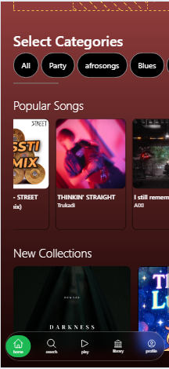
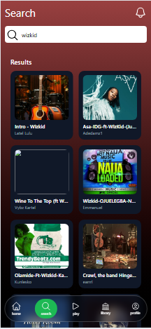
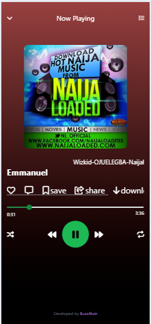

## 🎵 Buzzalvin Music App
A responsive, mobile-first music streaming web application built with HTML, Tailwind CSS v4, and JavaScript, powered by the Audius API.
The app allows users to explore trending music, search for tracks, and play songs through a sleek custom player UI. 

---
## 🚀 Current Features
🎶 Trending Music

   - Automatically fetches trending tracks using the Audius API.
🔍 Search Functionality
   - Real-time search for songs and artists
⏯ Full Music Player
   - Play / Pause
   - Next / Previous
   - Shuffle & Repeat
   - Seekable progress bar
   - Current time & duration
   - Dynamic display of song title, artist, and artwork
🧩 Multi-Page Layout
   - home.html – Trending songs
   - search.html – Search UI
   - musicplayer.html – Player page
💾 LocalStorage Song Transfer
   - Selected songs move from one page to another using localStorage.
📱 Responsive UI
   - Optimized primarily for mobile screen sizes.

---
## 🛠 Tech Stack
HTML • JavaScript • Tailwind CSS v4 • Audius API • LocalStorage • Git & GitHub

---
## 🌐 Audius API Endpoints Used 
📌 Trending tracks: 
GET /v1/tracks/trending 

📌 Search for tracks: 
GET /v1/tracks/search?query=
Retrieved data includes: 
- Song title 
- Artist 
- Artwork URL 
- Streaming URL

---
## 🧠 How the App Works 
- Home page loads trending songs via Audius API. 
- Search page lets user search for any track. 
- When a song is clicked, its metadata is saved to localStorage. 
- Music Player page reads that data and plays the selected track with full controls.

---
## 📌 How to Run
1. Clone the repo:
`git clone https://github.com/BuzzAlvin/buzzalvin-music-app.git`

2. Open `home.html` in your browser
3. Test playback functionality

---
## Screenshots
**Home Page**

**Search Page**

**Music Player**

---
## 🚧 Next Steps
- Playlist system
- Recently played section
- Dark mode
- Better animations and transitions
- Improved artwork handling
- Waveform visualization

---
## 🏷️ Version
- v1.0 
